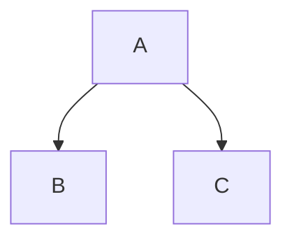

# Pokemon project
Get the pokemon data from pokemon api and upload to bigquery
https://pokeapi.co/docs/v2

# Feature
1. Install pokebase
`pip install pokebase`

2. 

```mermaid
graph TD;
    A-->B;
    A-->C;

```